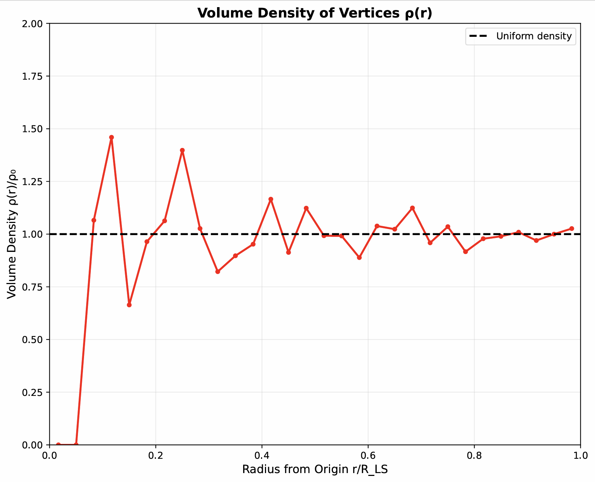
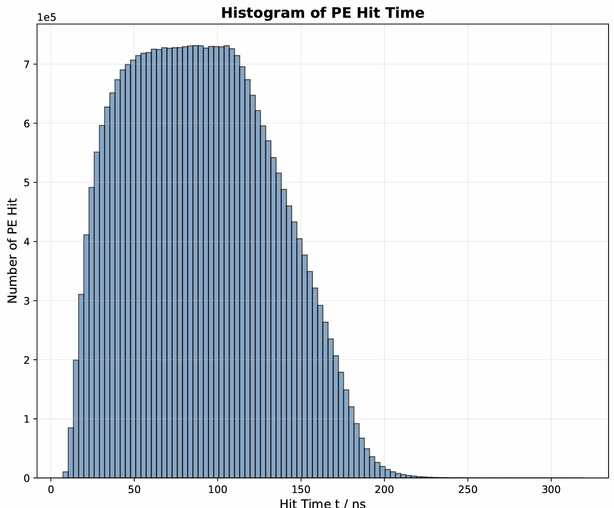
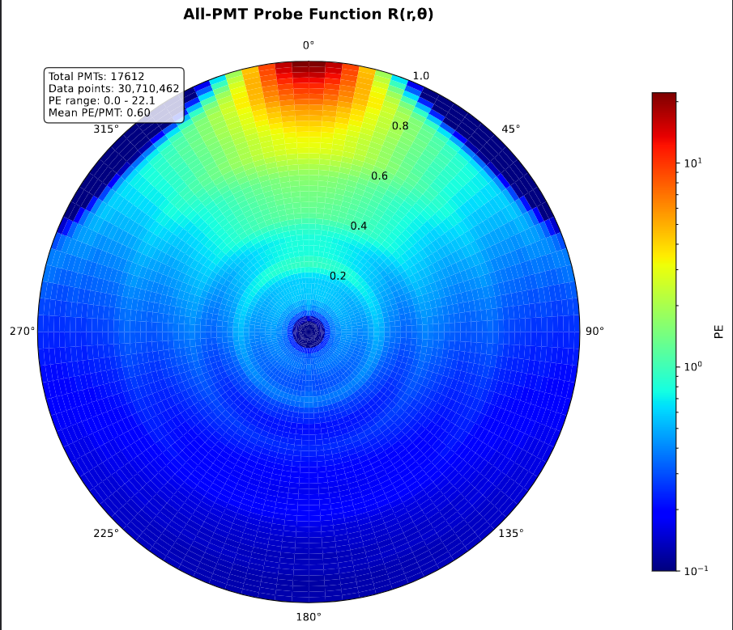

# 实验报告

**Members: 戴子森 王瀚正 魏飞扬**

**小组主要分工：**

- 戴子森：顶点、光子生成与光学过程模拟
- 王瀚正：绘图、代码检查与物理结果解读
- 魏飞扬：报告撰写与文件拆分

本项目完成了第一阶段大作业的基本要求，能够在 ~20s 内模拟单个 PMT 对 4000 个顶点的响应，并画出相应的 Probe 图像；此外，完成了Bonus1 进一步实现了在 ~7h 内模拟所有 17612 个 PMT 的响应的算法，并根据模拟数据绘制出图像。

## 取样阶段 (Sample)

通过 `sample_vertices_and_photons` 方法来取样顶点和光子。其中用到的重要数学方法实现细节如下：

### `sample_uniform_sphere_vectorized`

在半径 $R_{LS}$ 的球内采样 n 个均匀分布的点，以模拟体积数密度均匀的顶点分布。具体算法是先产生 $u,v,w \sim U[0,1)$，然后再经过形如
$$
r=u^{1/3} R_{LS} \\
\theta=\arccos(2v-1) \\
\phi=2\pi w
$$
的变换获得在 $r^3$、$\cos \theta$ 和 $\phi$ 上均为均匀分布的球坐标，最后变换为笛卡尔坐标。

### `sample_isotropic_direction_vectorized`

在单位球面上进行各向同性采样，以模拟各向同性的光子发射，流程与上面的方法类似，但只需产生上面的 $\theta$ 和 $\phi$。

### `double_exponential_pdf`

实现了要求中的双指数分布的概率密度函数，其中归一化常数
$$
C=\frac{\tau_d+\tau_r}{\tau_d^2}
$$

### `find_pdf_maximum`

用于找到双指数分布概率密度函数的最大值点，先通过解析方法求得双指数函数的导函数
$$
f'(\tau)=C \left[-\frac{1}{\tau_d} \mathrm{e}^{-t/\tau_d} \left(1-\mathrm{e}^{-t/\tau_r}\right) + \frac{1}{\tau_r} \mathrm{e}^{-t/\tau_d-t/\tau_r}\right]
$$
后令 $f'(\tau)=0$ 得到极大值点。

### `sample_emission_time_vectorized(n)`

使用接受-拒绝方法从双指数分布中采样光子发射时间。它利用 `find_pdf_maximum` 找到的最大值，并通过与一个提议分布（truncated exponential distribution）比较，来决定是否接受采样点，快速生成符合双指数分布的发射时间。

### `sample_poisson_photon_times()`

使用非齐次泊松过程来采样光子发射时间。首先，它从泊松分布中采样光子总数，然后使用 `sample_emission_time_vectorized` 函数采样每个光子的发射时间。

### `sample_single_vertex_photons()`

用于采样单个顶点的光子时间和方向。它使用 `sample_poisson_photon_times` 函数采样光子发射时间，并使用 `sample_isotropic_direction_vectorized` 函数采样光子发射方向。

### `sample_vertices_and_photons(n_vertices)`

整个取样过程的核心。它首先使用 `sample_uniform_sphere_vectorized` 函数在球体内采样顶点位置，然后对每个顶点，使用 `sample_single_vertex_photons` 函数采样光子数据（发射时间和方向）。此函数将所有步骤整合起来，生成模拟光子传输所需的完整数据，包括顶点位置、光子发射时间和方向。

## 计算阶段 (Compute)

根据作业要求，需要判断光线与 PMT 球面是否相交，并且判断相交的点位是否在 PMT 的前半球面（即朝向液闪球心的那一面）。此外，还需要计算光线是否发生全反射或折射。用到的数学方法实现细节如下：

### `ray_sphere_intersection_vectorized`

实现了射线与球体的相交计算，接受参数射线起点 $\bm{o}$ 和已归一化的方向 $\bm{d}$，则有射线方程
$$
\bm{p}(t) = \bm{o} + t\bm{d}
$$

将其与球面方程 $|\bm{p} - \bm{c}|^2 = r^2$ 联立得
$$
\bm{oc} \cdot \bm{oc} + 2t(\bm{oc} \cdot \bm{d}) + t^2(\bm{d} \cdot \bm{d}) = r^2
$$

然后通过判别式 $\Delta=b^2-4ac$ 判断有无焦点，以此得到掩码；然后求解 $t$ 的值，选择较小且大于零的 $t$，即射线正方向上的最近交点，焦点坐标即为 $\bm{p} = \bm{o} + t\bm{d}$，最后通过掩码筛选出有效交点。

### `compute_refraction_vectorized`

首先得到入射光线与法线的夹角，通过折射定律判断是否发生全反射，并且计算折射角，得到折射后光线的起点和方向。

### `is_front_surface_improved`

判断光线是否照射到 PMT 的前半表面，通过计算交点相对于 PMT 中心的位置向量与PMT指向球心方向的夹角来得到结果。

## 针对多个 PMT 的优化 (Simulate 阶段)

优化的多 PMT 模拟逻辑位于 `OptimizedPMTSimulator` 类中。

### `geometric_prefilter`

这是针对多个 PMT 进行优化的核心方法，先根据几何位置进行初步筛选可能被光子击中的 PMT，可以显著减少后续精确计算的 PMT 数量。具体方法是对于每个折射光子，计算与 PMT 方向的夹角，如果任何光子可能击中该 PMT，则保留。

### `compute_fresnel_reflection`

这一方法用菲涅尔方程计算了光子的反射系数，考虑了 s 偏振和 p 偏振的情形，进而确定一个光子在液闪-水界面是被反射还是透射，以此决定光子是否能进一步抵达 PMT。

## 绘图阶段 (Draw)

得到的 `figures.pdf` 中共有三幅图像：顶点的体积密度 $\rho(r)$ 随着与中心距离的关系；Hit Time 的直方图；作业中要求的 Probe 图像。

## 结果分析

| 顶点的数体积密度关于半径的图像 |
| :-: |
|  |

为了更清晰地展示顶点分布的均匀性，我们在绘制体密度图时，对坐标轴进行了归一化处理。具体来说，纵坐标体密度被归一化到预期的均匀体密度 $\rho_0 = \frac{N}{V} \approx 1.72\times 10^{-10} \text{mm}^{-3}$，横坐标半径则被归一化到液闪球的半径 $R_{LS} = 17.71\text{mm}$。同时，为了便于比较，我们在 $\rho/\rho_0 = 1$ 处添加了一条参考线。从最终的图中可以看出，生成的顶点分布在随机涨落范围内与均匀分布的要求基本一致。

| 光电子接收时间直方图 |
| :-: |
|  |

光电子到达时间的分布情况可以通过直方图进行可视化。在该直方图中，纵轴表示在特定时间间隔内探测到的光电子数量，横轴则表示光电子到达的时间，单位为 $\text{ns}$。生成的直方图展示了光电子在探测器上的时间分布特征。

| 最终的 Probe 示意图 |
| :-: |
|  |

从最后的 Probe 图像中可以看出：
- 从最靠近 PMT 的点（$r=1,\ \theta=0$）开始，能使光线照射到 PMT 前表面的顶点密度以 PMT（未出现在画面中）为中心向四周呈现下降趋势，符合一般意义上的平方反比律。
- 以 $45^\circ$ 为中心，附近有一片区域能照射到 PMT 的顶点很少，原因是此处发射的光大部分因为全反射而无法照射至 PMT。
- 光子探测概率呈现出以探测器中心为圆心的环状结构。此外，靠近探测器中心区域的光子数量明显偏低。这主要是由于模拟产生的事件数量有限（4000个），在统计涨落的影响下，导致在事件数量较少的区域探测到的光子数量偏少，从而在图像上呈现出较暗的区域。
